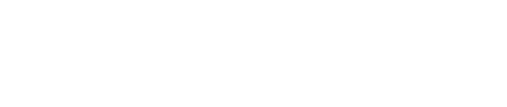

## Stack

---

## Links uteis

[Projeto no Figma](https://www.figma.com/file/dPHyzKfTNwDwgmqFFInYQ7/HopeHarvest?type=design&node-id=2%3A40&t=kiov5mU9dviB6M2u-1)

[Sample](https://hopeharvest.vercel.app/)

--- 

## Introdução

A fome é uma das mais graves "doenças sociais" dos nossos tempos. Apesar da promessa de fartura da pós-modernidade, a fome é comum em todos os ambientes urbanos. Nos últimos anos, somente no Brasil, a insegurança alimentar ultrapassou a marca de 60 milhões de pessoas, de acordo com um relatório da Organização das Nações Unidas para Alimentação e Agricultura (FAO). Para deixar mais claro o quão estarrecedores são esses números, três em cada dez pessoas lidaram, em algum grau, com a impossibilidade de se alimentar de maneira digna nos últimos anos. E esses dados escondem dentro de si uma verdade bastante incômoda: a fome está muito mais perto do que gostamos de admitir.

Infelizmente, a insegurança alimentar é um problema global e de causas sistêmicas e de difícil solução, principalmente no nível individual. Seja por conta da vergonhosa concentração de renda no mundo ou pela fragilização das cadeias de produção causada pela emergência climática ou por conflitos entre países, o combate à fome depende da boa vontade dos grandes players econômicos, bem como de uma mudança significativa na nossa maneira de viver. Entretanto, algumas pequenas ações podem trazer alívio à fome que está perto de nós e ainda permitir uma mudança de perspectiva mais do que necessária para que possamos projetar um futuro melhor para todos. É justamente aí que o HopeHarvest pode ajudar.

## HopeHarvest

HopeHarvest é uma plataforma digital que tem como objetivo facilitar o compartilhamento local de alimentos e reduzir a insegurança alimentar. A iniciativa é baseada em um projeto que tem como objetivo o compartilhamento de objetos domésticos entre vizinhos .

A plataforma é um mapa interativo em que usuários cadastrados, sejam eles pessoas físicas ou jurídicas, podem colocar alimentos para doação e indicar a sua respectiva localização. Outros usuários, por sua vez, podem fazer a reserva e coleta desses alimentos. Essa funcionalidade é semelhante ao que vemos em aplicativos de delivery de comida, porém, com uma importante diferença: os alimentos disponíveis na plataforma HopeHarvest  são doados por pessoas que desejam ajudar aqueles que estão em situação de vulnerabilidade.

O uso da plataforma é simples e intuitivo, semelhante a outros aplicativos de geolocalização. O usuário pode pesquisar alimentos disponíveis em sua região e, ao encontrar um item que deseja, basta fazer a reserva e combinar a coleta com o doador. Essa facilidade de acesso aos alimentos pode ser um alívio para muitas pessoas que lutam diariamente contra a fome.

Além de ajudar as pessoas que estão em situação de vulnerabilidade, a iniciativa também tem uma importante função educativa. Ao mostrar no mapa como a fome está mais perto do que muitas vezes se imagina, a plataforma pode ajudar a conscientizar a população sobre a extensão do problema e a urgência de uma ação conjunta para combatê-lo. Essa conscientização pode levar a uma mudança de perspectiva e atitudes mais solidárias.

## Conclusão

Em resumo, a plataforma HopeHarvest  é uma iniciativa importante que tem o potencial de facilitar o compartilhamento local de alimentos e de conscientizar a população sobre a extensão da fome no país. A plataforma é uma ferramenta valiosa para ajudar a reduzir a insegurança alimentar e promover uma mudança de perspectiva em relação ao problema.

--- 

### Projeto desenvolvido para o curso de sistemas para internet da FIAP
